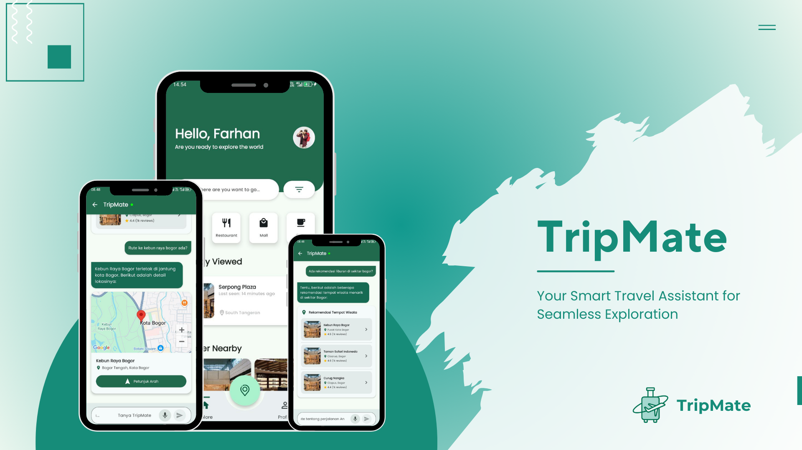

# 🌍 TripMate — Your Personal Travel Companion

**TripMate** is a modern Android travel recommendation application designed to help users explore nearby destinations, discover places by category or city, communicate with AI or customer service, and plan trips seamlessly — all powered by smart integrations and a clean, intuitive UI using Jetpack Compose.

---

## ✨ Features

- 🔍 **Nearby Destination Recommendations**  
  Discover interesting places around your current location.

- 🏙️ **Category-Based Search**  
  Explore places based on travel categories like hotels, malls, parks, and more.

- 🗺️ **City-Based Recommendations**  
  Find top travel destinations within a specific city.

- 🤖 **AI Travel Assistant**  
  Ask for recommendations, best routes, or trip ideas using an intelligent assistant.

- ⭐ **Location Rating System**  
  Rate places you visit and view ratings from other users.

- 📞 **Smart Communication**  
  Make voice calls with an AI travel assistant or directly with human customer service.

- 💾 **Favorite Collections**  
  Save and manage your favorite travel destinations for future trips.

---

## 🛠️ Tech Stack & Integrations

- 📍 **Geoapify API** – Location search, geocoding, and nearby place discovery  
- 📸 **Pexels API** – High-quality images of travel destinations  
- 🗺️ **Google Maps API** – Interactive map integration  
- 🔁 **N8n** – Workflow orchestration (AI assistant logic, call routing, etc.)  
- 📞 **Agora API** – Real-time voice call feature  
- 🏠 **Room Database** – Local data storage  
- 🔐 **Firebase Authentication** – Secure user login and signup  
- ☁️ **Firebase Firestore** – Cloud-hosted NoSQL database  
- 🧩 **Jetpack Compose** – Modern UI toolkit for Android

---

## 📦 Installation

1. Clone this repository:
   ```bash
   git clone https://github.com/yourusername/TripMate.git
   cd TripMate
    ```

2. Open the project in **Android Studio**.

3. Set up your API keys:

   * `GEOAPIFY_API_KEY`
   * `PEXELS_API_KEY`
   * `GOOGLE_MAPS_API_KEY`
   * `AGORA_APP_ID`
   * `AGORA_TEMP_TOKEN`
   * Firebase setup (`google-services.json`)

4. Run the project on an Android emulator or device.


---

## 🤝 Contributing

Contributions are welcome! Please open an issue first to discuss what you’d like to change.